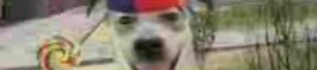
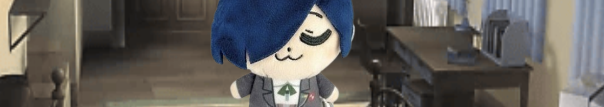

# CART 253 

Matteo Edmonds-Tiano (Matt or Hikki(Actually dont say this one its too cringe!))

## Reflective Journal

[Reflective Journal](./journal.md)

## Description

> **Cart 253 Creative Computation 1**

> 

This is a website that is designed to show the progess of learning javascript, p5js, and my overall growth throught out this class. This website will hold all of the prototypes that I will be doing in this class and will in all be an archive of all the prototypes we've done in CART 253.

> *Hi* Leaving this here for when needed.

> Will leave here for when explinations of controls is needed.

> What these prototypes or specific prototyope is trying to show.(Keeping here for when needed.)

------------

 # Prototypes:

## [Prototypes Instructions Journal](./journal.md)

### Prototype Instructions assignment 1

> [Fancy Kirby](https://hikki0001.github.io/cart253-testing/Prototyping%20Instructions%20folder/Prototyping%20Instructions%20Kirby/)

> [Code](https://github.com/Hikki0001/cart253-testing/blob/main/Prototyping%20Instructions%20folder/Prototyping%20Instructions%20Kirby/js/script.js)

> [Heavenly Stairs](https://hikki0001.github.io/cart253-testing/Prototyping%20Instructions%20folder/Prototyping%20Instructions%20Trying%20Something/)

> [Code](https://github.com/Hikki0001/cart253-testing/blob/main/Prototyping%20Instructions%20folder/Prototyping%20Instructions%20Trying%20Something/js/script.js)

> [That One Guy Thats Purple](https://hikki0001.github.io/cart253-testing/Prototyping%20Instructions%20folder/Prototyping%20instructions%20Purple/)

> [Code](https://github.com/Hikki0001/cart253-testing/blob/main/Prototyping%20Instructions%20folder/Prototyping%20instructions%20Purple/js/script.js)

---------

## [Prototypes Variables Journal](./journal.md)

### Prototype Variables assignment 2

> [HappyDog](https://hikki0001.github.io/cart253-testing/Prototyping%20Variables%20folder/Prototyping%20Variables%20Happy%20Dog)

> [Code](https://github.com/Hikki0001/cart253-testing/blob/main/Prototyping%20Variables%20folder/Prototyping%20Variables%20Happy%20Dog/js/script.js)

> [UsagiandHachiware](https://hikki0001.github.io/cart253-testing/Prototyping%20Variables%20folder/variables-prototype-UsagiandHachiware/)

> [Code](https://github.com/Hikki0001/cart253-testing/blob/main/Prototyping%20Variables%20folder/variables-prototype-UsagiandHachiware/js/script.js)

> [ParanoidEye](https://hikki0001.github.io/cart253-testing/Prototyping%20Variables%20folder/variables-prototype-eyeball/)

> [Code](https://github.com/Hikki0001/cart253-testing/blob/main/Prototyping%20Variables%20folder/variables-prototype-eyeball/js/script.js)

---------

## [Prototypes Conditionals Journal](./journal.md)

### Prototype Conditionals assignment 2

> [SleepingMakoto](https://hikki0001.github.io/cart253-testing/Prototyping%20Conditionals%20folder/conditionals-makotosleep/)

> [Code](https://github.com/Hikki0001/cart253-testing/blob/main/Prototyping%20Conditionals%20folder/conditionals-makotosleep/js/script.js)

> [SchrodingersCat](https://hikki0001.github.io/cart253-testing/Prototyping%20Conditionals%20folder/conditionals-cat/)

> [Code](https://github.com/Hikki0001/cart253-testing/blob/main/Prototyping%20Conditionals%20folder/conditionals-cat/js/script.js)

> [ChasingTakumi](https://hikki0001.github.io/cart253-testing/Prototyping%20Conditionals%20folder/conditionals-dot/)

> [Code](https://github.com/Hikki0001/cart253-testing/blob/main/Prototyping%20Conditionals%20folder/conditionals-dot/js/script.js)

## Attribution

**This is where we put code, assets, and any other elements that was from other sources(I'm keeping the p5js line for now.)**

> - This project uses [p5.js](https://p5js.org).
> - I have a Visual Novel I'm currently developing: https://hikki000.itch.io/how-do-you-see-the-sky-build-2-chapter-1
> - Here's my favorite song right now: https://youtu.be/cFV30vTZmlw?si=J_E3jPem7iHFjjJv
## License

This bit should include the license you want to apply to your work. For example:

> This project is licensed under a Creative Commons Attribution ([CC BY 4.0](https://creativecommons.org/licenses/by/4.0/deed.en)) license with the exception of libraries and other components with their own licenses.